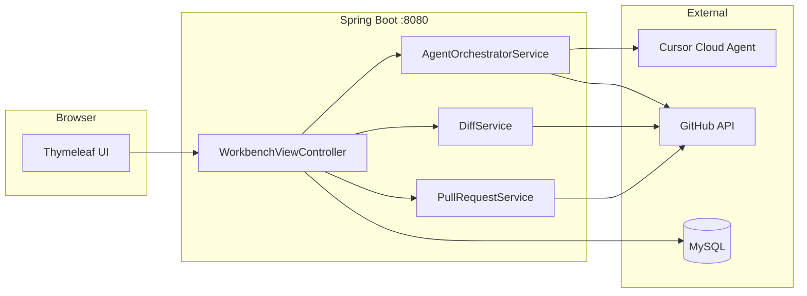

# GitHub Copilot With Cursor

> **GitHub URL + 자연어 프롬프트** → Cursor Cloud Agent가 fork branch에 코드를 수정 → Spring Boot가 pull·Diff·(선택) PR까지 처리하는 **Cloud-first 리포지토리 워크벤치**

GitHub Copilot Coding Agent와 유사한 **리포지토리 에이전트 워크플로**를, **Cursor Cloud Agents API**와 **Spring Boot**로 직접 구현한 풀스택 포트폴리오 프로젝트입니다.

<br>

## Highlights

| 영역 | 구현 내용 |
|------|-----------|
| **Cursor 연동** | Cloud Agents REST API v1 · `RestClient` · Agent lifecycle (start / poll / sync / cancel) |
| **GitHub 연동** | fork·branch·push·draft PR · GitHub REST API |
| **Diff** | JGit `headCommitSha` vs working tree · 대용량 파일 크기 제한 |
| **웹 UI** | Thymeleaf 단일 앱 (`index` → `wait` → `diff` → `commit` → `pr`) |
| **데이터** | MySQL · JPA · Flyway V1~V6 |
| **운영 모드** | **Review** (Diff·보관) · **Contribute** (commit + upstream PR) |
| **보안** | 토큰 환경변수 전용 · RestClient Authorization 마스킹 |

<br>

## Architecture



**흐름 요약:** URL·프롬프트 입력 → fork/branch 준비 → Cloud Agent push → Spring `fetch`/`pull` → Diff 확인 → Review 종료 또는 Contribute PR.

상세 시퀀스·컴포넌트: [아키텍처 문서](docs/git_hub_readme/01-architecture.md)

<br>

## Tech Stack

| 분류 | 기술 |
|------|------|
| Language | Java 17 |
| Backend | Spring Boot 4 · WebMVC · JPA · Validation · Actuator |
| Frontend | Thymeleaf · static CSS |
| Database | MySQL 8 · Flyway |
| Git | JGit · java-diff-utils |
| External API | Cursor Cloud Agents API · GitHub REST API |
| API Doc | Springdoc OpenAPI (Swagger UI) |

<br>

## Workflow

### Review — 코드 검토·보관

fork → Cloud Agent 수정·push → Diff 확인 → 로컬 보관 (**upstream PR 없음**)

### Contribute — upstream PR까지

Review와 동일 + Diff 후 **commit → push → draft PR**  
PR 제목·본문은 repo Agent **follow-up run**으로 pre-fill (Composer follow-up)

Diff 후 「추가 수정」이 필요하면 로컬 **Cursor IDE**(`cursor` CLI)만 실행합니다 (M1).

<br>

## Screenshots

> 로컬 실행 후 `docs/images/`에 캡처를 추가할 수 있습니다.  
> 권장: `index` · `wait` · `diff` · `pr`

<br>

## Quick Start

**사전 요구:** Java 17+ · MySQL 8.x · Git · `GITHUB_TOKEN` · `CURSOR_API_KEY`

```powershell
$env:GITHUB_TOKEN = "ghp_..."
$env:CURSOR_API_KEY = "key_..."
.\gradlew.bat bootRun
```

- **UI:** http://localhost:8080  
- **Swagger:** http://localhost:8080/swagger-ui.html  
- **Health:** http://localhost:8080/actuator/health  

MySQL·Cursor Dashboard·Composer timeout 등: [실행 가이드](docs/git_hub_readme/04-getting-started.md)

<br>

## Project Structure

```
src/main/java/com/demo/githubcopilotwithcursor/
├── config/        # Flyway, RestClient, Properties
├── controller/    # REST API + Thymeleaf Web
├── cursor/        # Cursor Cloud Agents 클라이언트·DTO
├── github/        # GitHub REST 클라이언트
├── service/       # Agent, Diff, Commit, PR, Workspace
├── domain/        # JPA 엔티티
└── dto/           # 요청/응답

src/main/resources/
├── templates/     # index, wait, diff, commit, pr
└── db/migration/  # V1~V6
```

REST·Web API 전체 목록: [기능·API 문서](docs/git_hub_readme/02-features.md)

<br>

## Technical Decisions

- Cloud Agent **`composer-2.5` Fast** (`fast=true`) · **`autoCreatePR=false`** — PR은 Spring `PullRequestService`만
- Agent push 후 Spring **`fetch` + `pull --ff-only`** → Diff 기준 `headCommitSha`
- API 경로 **`/{repoOwner}/{repoName}`** 2-segment (GitHub URL owner/name)

더 보기: [기술 결정](docs/git_hub_readme/03-tech-decisions.md) · [문제 해결](docs/git_hub_readme/05-troubleshooting.md)

<br>

## Development Note

본 저장소는 **Cursor AI 에이전트(기획·구현·테스트 역할 분리)** 로 개발했습니다.  
앱 실행·fork에는 영향 없으며, 협업 규칙은 [`.cursorrules`](.cursorrules)에 정리되어 있습니다.

<br>

---

**GitHub Copilot With Cursor** · Cloud-first Workbench v3.0.2
