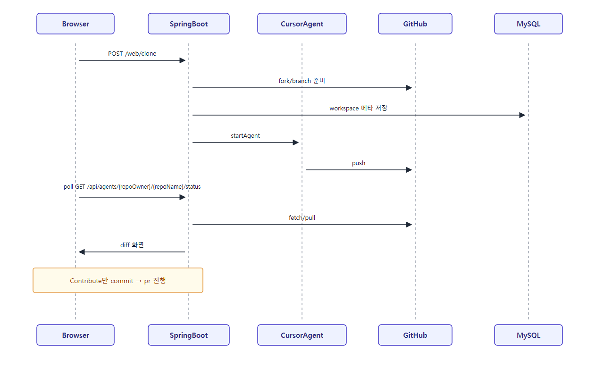
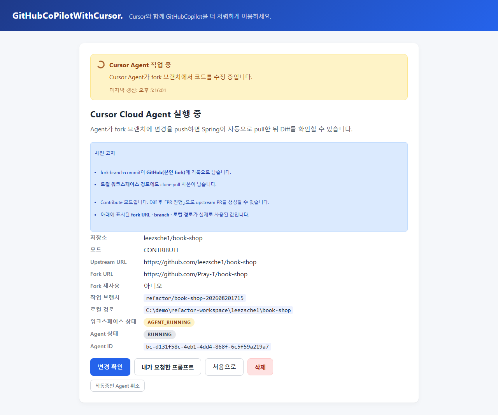
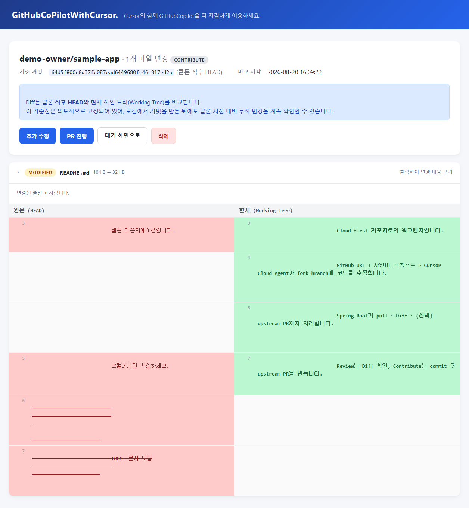
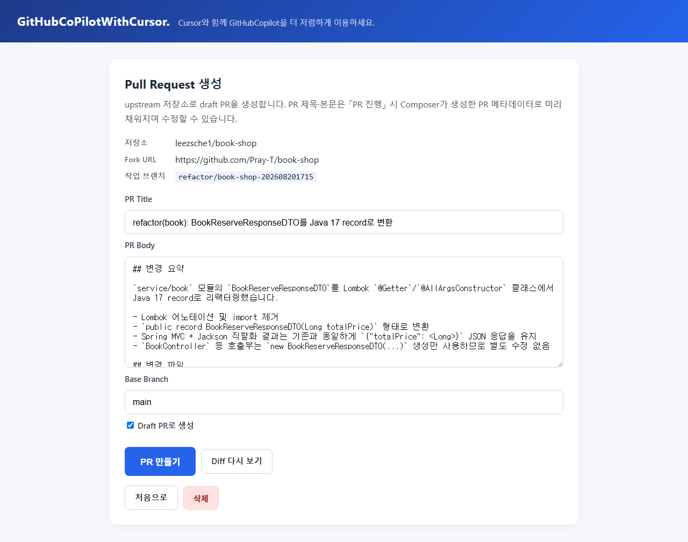

# GitHub Copilot With Cursor

**긍정적으로 일하고 세상에 도움이 되는 사람이 되자.**
  

  

안녕하세요 먼저 귀한 시간을 내어 저의 깃허브에 방문해 주신 것에 감사드립니다.  

저는 팀의 일원으로서 팀원들과 함께 좋은 에너지를 만들며 일하고 싶고, 동시에 혼자 고민하는 시간을 통해 전문가로서의 역량을 기르고자 하고 적은 비용으로 어떻게 하면 많은 효과를 누릴 수 있을까? 하고 생각하는 개발자입니다.
  

  

이 프로젝트는 "GitHub Copilot Coding Agent"와 유사한 **리포지토리 에이전트 워크플로**를, **Cursor Cloud Agents API**와 **Spring Boot**로 직접 구현한 풀스택 포트폴리오 프로젝트입니다.   
  

**한줄 소개:** **GitHub URL + 자연어 프롬프트** → Cursor Cloud Agent가 fork branch에 코드를 수정 → Spring Boot가 pull·Diff·(선택) PR까지 처리하는 **Cloud-first 리포지토리 워크벤치**입니다.

<details>
<summary><strong>화면 스크린샷</strong> — 클릭하면 메인·흐름·대기·Diff·PR 화면이 펼쳐집니다</summary>

### 메인 화면

GitHub URL과 Agent 프롬프트를 입력하고, 활성 워크스페이스 상태를 확인합니다.


### 흐름

Browser → Spring Boot → Cursor Cloud Agent · GitHub · MySQL. Contribute 모드만 Diff 이후 commit → PR로 이어집니다.



### Agent 대기 화면

Cloud Agent가 fork 브랜치에서 작업하는 동안 5초 간격으로 상태를 폴링합니다. 실제로 사용된 fork URL · 작업 브랜치 · 로컬 경로를 사전 고지와 함께 보여줍니다.



### Diff 화면

클론 직후 HEAD와 현재 Working Tree를 비교합니다. 파일 행을 펼치면 추가·삭제 줄을 확인할 수 있습니다.



### PR 작성 화면 (Contribute)

Diff 확인 후 「PR 진행」을 누르면 Composer가 커밋 메시지 · PR 제목 · 본문을 한 번 생성해 폼을 채웁니다. upstream PR 생성은 이 화면의 「PR 만들기」로만 이뤄집니다.



</details>


### 성과 · 규모 하이라이트

- **운영 모드 2종** — Review(Diff·로컬 보관) · Contribute(commit + upstream PR)
- **단위·통합 테스트 약 90개** — 테스트 클래스 30여 개 (`MockMvc` E2E·서비스·GitHub/Cursor 클라이언트)
- **Flyway 마이그레이션 7단계** — V1 초기 스키마 ~ V7 `llm_diff_fingerprint` 캐시
- **외부 API 직접 연동** — Cursor Cloud Agents · GitHub REST를 Spring `RestClient`로 호출


## 기술 스택


| 구분           | 기술                                                       |
| ------------ | -------------------------------------------------------- |
| Language     | Java 17                                                  |
| Framework    | Spring Boot 4                                            |
| ORM          | Spring Data JPA (Hibernate)                              |
| Database     | MySQL                                                    |
| Migration    | Flyway                                                   |
| Git          | JGit                                                     |
| External API | Cursor Cloud Agents API · GitHub REST API (`RestClient`) |
| API Docs     | springdoc-openapi (Swagger UI)                           |


## 왜 만들었나

GitHub Copilot Coding Agent처럼 *"프롬프트만 주면 에이전트가 알아서 브랜치를 만들고 코드를 고쳐 PR을 올리는"* 워크플로를 **Cursor Cloud Agents API를 Spring Boot에서 직접 호출**해서 재현해보고 싶었습니다.

실서비스에서 마주치는 관심사를 더 저렴하게 만들어볼 수 없을까?하는 생각에서 출발한 프로젝트입니다.

- **외부 에이전트 API 연동** — 에이전트 실행·상태 폴링·완료 후 동기화
- **Git 자동화** — JGit 기반 fork·branch·pull·Diff·commit·upstream PR
- **운영 관심사** — 토큰 보안(마스킹), DB 마이그레이션, 워크스페이스 정리 스케줄러


## 빠른 시작


### 사전 요구

Java 17+, MySQL 8.x, Git · GitHub PAT(`repo`) · Cursor Cloud Agents API key

### 환경 변수

```powershell
$env:GITHUB_TOKEN = "ghp_..."
$env:CURSOR_API_KEY = "key_..."
```


### 기동

```powershell
.\gradlew.bat bootRun    # Windows
./gradlew bootRun        # Linux / macOS
```

→ [http://localhost:8080](http://localhost:8080) · [Swagger UI](http://localhost:8080/swagger-ui.html)

  


## 에이전트 협력 방식

위 화면과 기동 방법은 **이 앱이 무엇을 하는지**입니다. 이 절은 **이 저장소를 여러 에이전트가 어떻게 협력하여 만들었는지**입니다.

에이전트는 세션이 끝나면 이전 대화를 공유하지 않습니다. 그래서 `.cursorrules`에 역할과 금지를 적고, 기획 문서에 무엇을 만들지 고정하고, `STATUS.md`에 지금 어디까지인지를 남깁니다. 파일을 고치고 명령을 실행하는 것은 Cursor가 합니다. 문서는 세션이 바뀌어도 기획·구현·테스트 에이전트가 **같은 규칙과 같은 인수인계**를 보게 합니다.

**작업 체인:** `@AgentA`(기획) → `@AgentC`(구현) → `@AgentB`(통합 테스트·디버깅)

| 산출물 | 하는 일 |
|--------|---------|
| `.cursorrules` | 역할·권한·금지·작업 체인. 사용자만 수정 |
| `docs/PRD.md` · `API_SPEC.md` · `DB_SCHEMA.md` | 매 세션에 다시 읽는 사전지식. 구현·테스트의 정본 |
| `TECH_SPEC.md` | 기획과 코드가 어긋날 때의 실제 설계 기록 |
| `STATUS.md` Append-only | 세션을 넘기는 공유 상태·인수인계 |


자세한 권한·인수인계 규칙은 [5. 에이전트 협력 방식](./docs/git_hub_readme/05-agent-collaboration.md)에서 이어서 읽으실 수 있습니다.

## 상세 문서

*아래 링크를 클릭하시면 해당 상세 페이지로 이동합니다.*

## [1.웹앱 흐름 및 아키텍처 개요](./docs/git_hub_readme/01-architecture.md)

Browser → Spring Boot → Cursor Cloud Agent · GitHub · JGit · MySQL 흐름, `repoOwner`/`repoName` 경로 규칙, 시퀀스 다이어그램, 화면 흐름(`index` → `wait` → `diff` → `commit` → `pr`).

## [2.주요 기능](./docs/git_hub_readme/02-features.md)

Review·Contribute 모드, Agent wait 폴링, Diff 확인, 로컬 IDE 추가 수정, REST·Web API 요약표.

## [3.기술적 고민 및 아키텍처 결정](./docs/git_hub_readme/03-tech-decisions.md)

- Composer 2.5 Fast(`fast=true`) 모델 고정 및 `autoCreatePR=false` 정책
- Agent push 후 Spring `fetch`/`pull --ff-only` 기반 Diff
- PR 메타: 코드 수정에 사용했던 같은 Agent에 **follow-up**을 보내 작성한다. 새로운 Agent가 PR메타를 작성하여 환각 증세를 방지하기 위함입니다.
- PR 메타 캐시: **diff fingerprint**로 hit/miss 판정 (IDE 추가 수정 시 재생성)
- `WorkspaceGitStateService`로 uncommitted/unpushed JGit 상태 판정 · PR 생성 직전 **no-force push** (`ensureBranchPushed`, FR-8.6)
- Flyway V7 `llm_diff_fingerprint`, 토큰 마스킹(`AuthorizationMaskingInterceptor`) 등


## [4.문제 해결](./docs/git_hub_readme/04-troubleshooting.md)

Composer fallback, 재클론 실패, Flyway 오류, GitHub 잔존 리소스.

## [5.에이전트 협력 방식](./docs/git_hub_readme/05-agent-collaboration.md)

문서와 역할로 기획·구현·테스트를 나눈 방식. `.cursorrules` 권한, AgentA→AgentC→AgentB 체인, 사전지식과 실시간 인수인계의 구분.

  


  


## 다른 포트폴리오

- [은행 이체 REST API를 통해 MySQL 동시성 정합성과 Redis 멱등성/스로틀을 중심으로 구현, 대량 데이터 인덱스 조회 실험 검증](https://github.com/Pray-T/BankTransferSys_Backend_Restful) 
- [AWS에 배포·운영한 JWT+Redis 이중 토큰 인증과 실시간 채팅 웹 앱](https://github.com/Pray-T/ReadyPlz-Production_main)

**이상입니다, 저의 깃허브 방문을 감사드립니다.**
