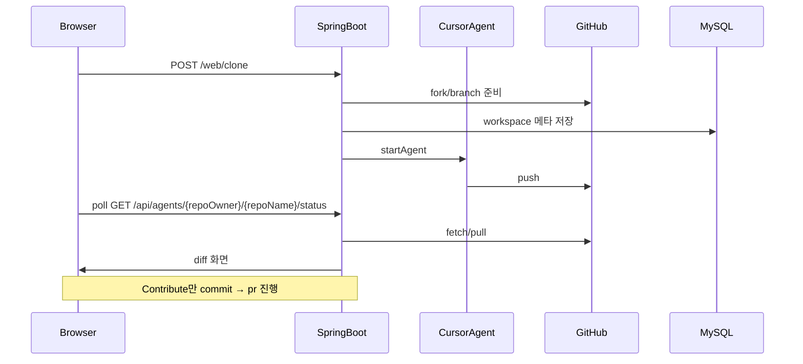

# 1. 아키텍처 (v3)

> 포트폴리오 README의 [Architecture](../../README.md#architecture) 보완 문서입니다.

## 한 줄 요약

Browser → Spring Boot(:8080) → Cursor Cloud Agents API + GitHub API + JGit + MySQL

## 흐름 (Review·Contribute 공통)

## repoOwner / repoName

GitHub URL `https://github.com/{repoOwner}/{repoName}`에서 추출합니다.

- API·Web 경로는 **`/{repoOwner}/{repoName}` 2-segment**가 표준 (Flyway V4 이후)
- 동일 repoName이라도 owner가 다르면 별도 워크스페이스

예: `https://github.com/octocat/Hello-World` → `repoOwner=octocat`, `repoName=Hello-World`

## 주요 컴포넌트

| 계층 | 클래스 |
|------|--------|
| Cursor API | `CloudAgentClient`, `CursorAuth` |
| Agent | `AgentOrchestratorService`, `AgentSyncService` |
| LLM | `LlmMetadataService` |
| Git | `WorkspaceBootstrapService`, `DiffService`, `CommitPushService`, `PullRequestService` |
| Web | `WorkbenchViewController` |

## 패키지 구조

`com.demo.githubcopilotwithcursor.{config|controller|cursor|domain|dto|exception|github|repository|service}`

## 화면

`index` → `wait`(Agent 5초 폴링) → `diff` → (선택) IDE / (Contribute) `commit` → `pr`

Contribute에서 uncommitted 변경이 없으면 `commit` 단계를 건너뛸 수 있습니다.
