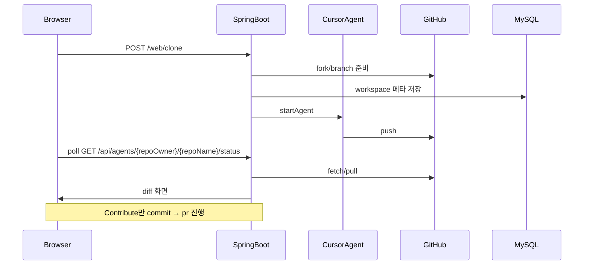
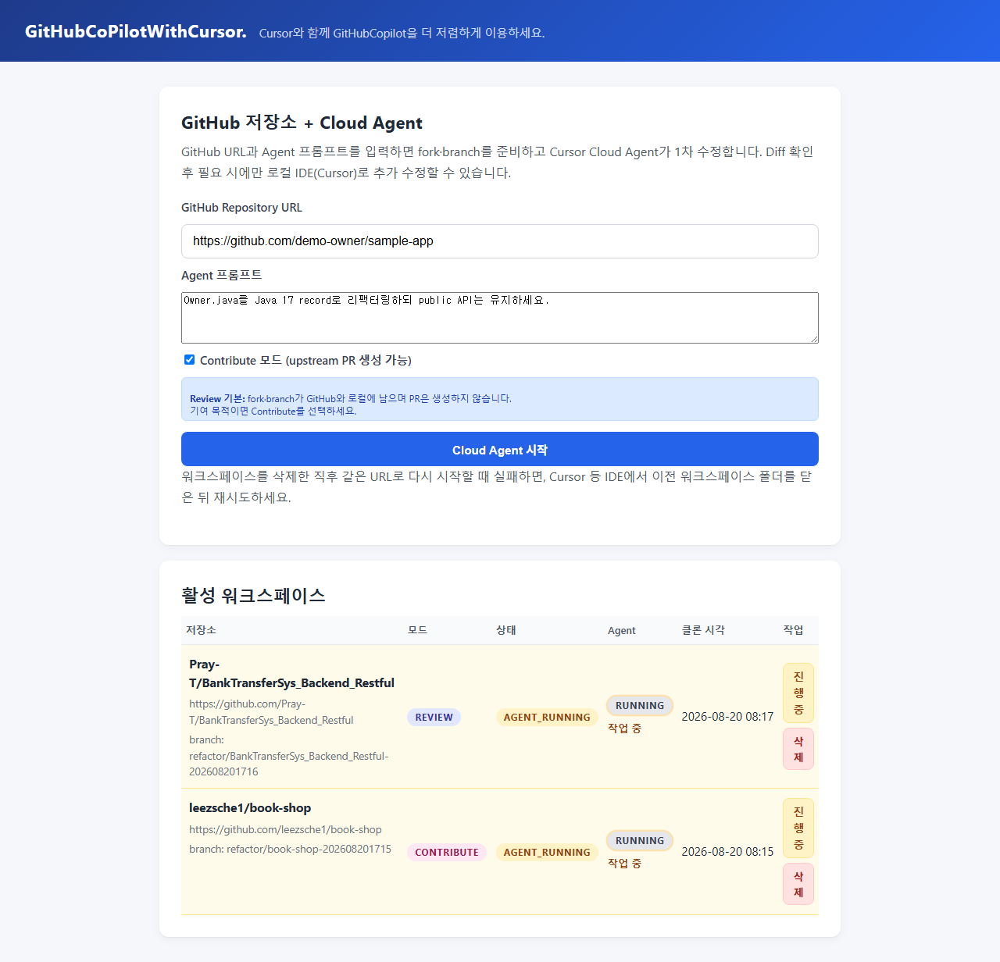
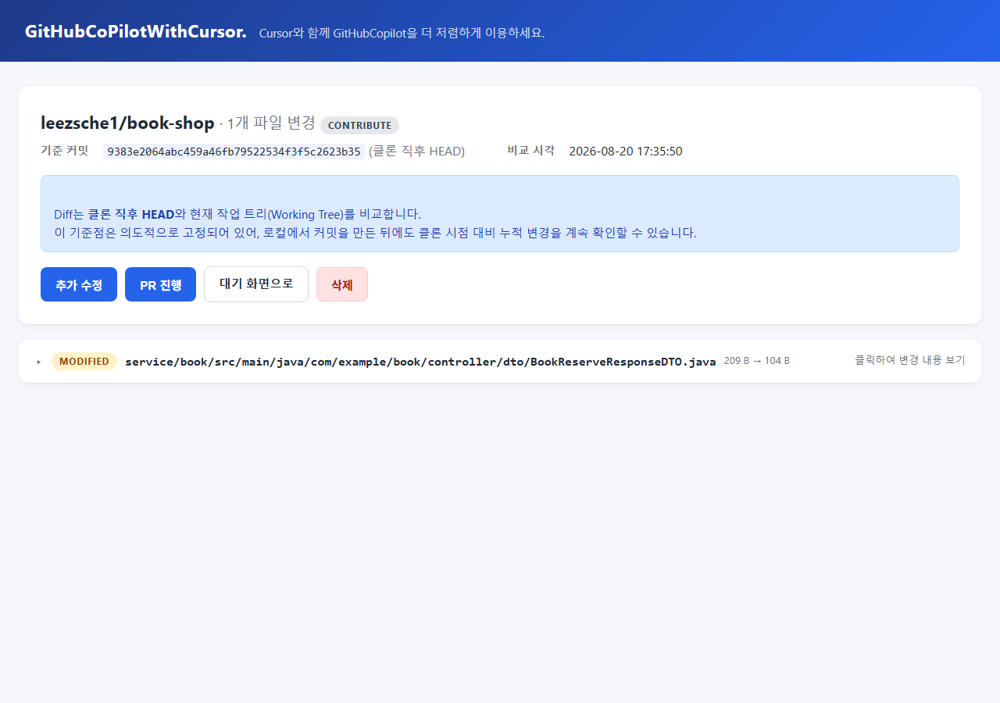
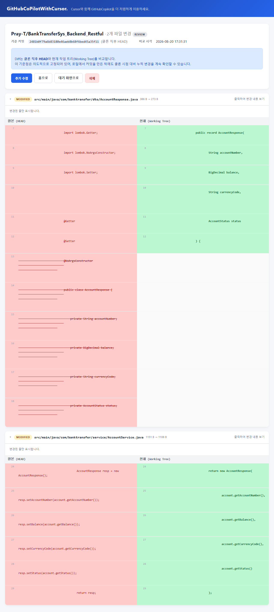
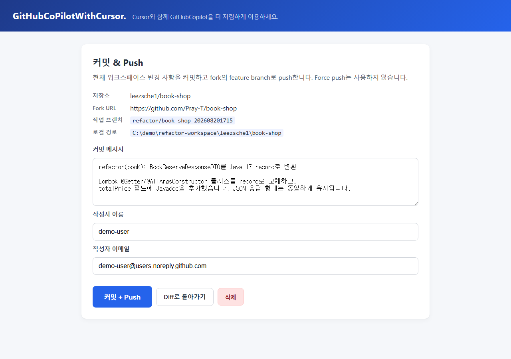

# 1. 아키텍처

 [메인 README로 돌아가기](../../README.md)

## 한 줄 요약

Browser → Spring Boot(:8080) → Cursor Cloud Agents API + GitHub API + JGit + MySQL

## 흐름 (Review·Contribute 공통)

```mermaid
sequenceDiagram
  participant Browser
  participant SpringBoot
  participant CursorAgent
  participant GitHub
  participant MySQL

  Browser->>SpringBoot: POST /web/clone
  SpringBoot->>GitHub: fork/branch 준비
  SpringBoot->>MySQL: workspace 메타 저장
  SpringBoot->>CursorAgent: startAgent
  CursorAgent->>GitHub: push
  Browser->>SpringBoot: poll GET /api/agents/{repoOwner}/{repoName}/status
  SpringBoot->>GitHub: fetch/pull
  SpringBoot->>Browser: diff 화면
  Note over Browser,SpringBoot: Contribute만 commit → pr 진행
```

## repoOwner / repoName

GitHub URL `https://github.com/{repoOwner}/{repoName}`에서 추출합니다.

- API·Web 경로는 2-segment가 표준입니다. 다음과 같이 묶습니다. `/{repoOwner}/{repoName}` 
- 동일 repoName이라도 owner가 다르면 별도 워크스페이스로 취급합니다.

예: `https://github.com/octocat/Hello-World` → `repoOwner=octocat`, `repoName=Hello-World`

## 주요 컴포넌트

| 계층 | 클래스 |
|------|--------|
| Cursor API | `CloudAgentClient`, `CursorAuth` |
| Agent | `AgentOrchestratorService`, `AgentSyncService` |
| LLM | `LlmMetadataService`, `DiffFingerprintService` |
| Git 상태 | `WorkspaceGitStateService` (`hasUncommittedChanges` / `hasUnpushedCommits`) |
| Git | `WorkspaceBootstrapService`, `DiffService`, `CommitPushService`, `PullRequestService` |
| Web | `WorkbenchViewController` (PR 흐름 uncommitted/stale 가드) |

## 패키지 구조

`com.demo.githubcopilotwithcursor.{config|controller|cursor|domain|dto|exception|github|repository|service}`

## 화면

`index` → `wait`(Agent 5초 폴링) → `diff` → (선택) IDE / (Contribute) `commit` → `pr`

Contribute에서 uncommitted 변경이 없으면 `commit` 단계를 건너뛸 수 있습니다.

## Screenshots

로컬 실행 기준 실제 UI 캡처입니다.

