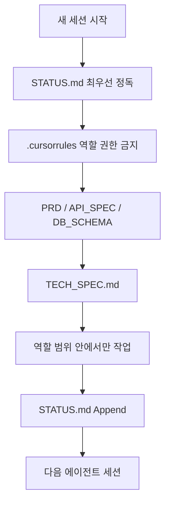

# 5. 에이전트 협력 방식

 [메인 README로 돌아가기](../../README.md)

## 한 줄 요약

에이전트는 세션이 끝나면 이전 대화를 공유하지 않습니다. 이 저장소는 [`.cursorrules`](../../.cursorrules) · 기획 정본 · [`STATUS.md`](../../STATUS.md)로 규칙과 인수인계를 남기고, `@AgentA`(기획) → `@AgentC`(구현) → `@AgentB`(통합 테스트·디버깅)로 역할을 나눴습니다. 에이전트가 서로를 직접 부르지 못하게 하고, **문서가 그 자리를 대신합니다.**

## 이 문서가 다루는 것

메인 [README](../../README.md)의 앞부분은 **앱이 무엇을 하는지**입니다. GitHub URL + 자연어 프롬프트 → Cursor Cloud Agent가 fork 브랜치를 수정 → Spring Boot가 pull·Diff·(선택) PR을 처리하는 Cloud-first 워크벤치입니다.

이 페이지는 **그 앱을 여러 에이전트가 어떻게 협력하여 만들었는지**입니다.

| 층 | 주체 | 하는 일 |
|----|------|---------|
| 제품 | Spring Boot가 호출하는 **Cursor Cloud Agents API** | 사용자가 넣은 GitHub 저장소를 Cloud Agent가 수정합니다 |
| 이 저장소를 만든 방식 | Cursor IDE 안의 에이전트 + **문서·역할·인수인계** | 기획·구현·테스트 에이전트가 같은 규칙과 같은 사전지식을 보고 일합니다 |

## Cursor가 하는 일, 문서가 하는 일

| 구분 | 하는 일 |
|------|---------|
| **Cursor** | 파일을 읽고 고치고, 터미널을 실행하고, Cloud Agents API를 제공합니다 |
| **이 저장소의 문서** | 무엇을 만들지, 누가 어떤 파일을 수정해도 되는지, 지금 어디까지인지를 세션마다 같게 읽게 합니다 |

## 왜 문서가 필요한가

에이전트는 **세션 기억을 공유하지 않습니다.** 새 세션의 `@AgentC`는 어제 `@AgentA`가 채팅에서 한 말을 모릅니다. `@AgentB`는 `@AgentC`의 구현 의도를 대화 기록에서 이어받지 못합니다.

그래서 매 세션 시작 시 같은 파일을 읽게 합니다.

1. **사전지식** — 무엇을 만들지, HTTP·DB 계약, 역할·금지. 세션마다 다시 읽습니다.
2. **실시간 인수인계** — 지금 어디까지 끝났는지, 다음에 누가 무엇을 할지. 세션이 끝날 때 남깁니다.

문서는 채팅 로그의 요약이 아닙니다. **에이전트가 서로를 호출할 수 없을 때, 호출 대신 쓰는 공유 기록**입니다.



## 문서가 하는 일

| 산출물 | 하는 일 |
|--------|---------|
| [`.cursorrules`](../../.cursorrules) | 역할·권한·금지·작업 체인. 가이드와 강제 규칙. **사용자만 수정** |
| [`docs/PRD.md`](../PRD.md) | 무엇을 만들지. 제품 요구사항 |
| [`docs/API_SPEC.md`](../API_SPEC.md) | HTTP 계약 |
| [`docs/DB_SCHEMA.md`](../DB_SCHEMA.md) | 데이터 계약 |
| 위 기획 3종 | 매 세션에 다시 읽는 사전지식. 구현·테스트의 **Single Source of Truth**(정본) |
| [`TECH_SPEC.md`](../../TECH_SPEC.md) | 기획과 코드가 어긋날 때의 실제 설계 기록. 기획을 고치지 않고 Append |
| [`STATUS.md`](../../STATUS.md) Append-only | 세션을 넘기는 공유 상태·인수인계 게시판 |
| `@AgentA` → `@AgentC` → `@AgentB` + 모델 고정 | 역할 분담과 작업 순서 |
| force push 금지, 토큰 마스킹, `autoCreatePR=false`, docs 수정 금지 등 | 에이전트에게 적어 둔 금지 사항 |
| `@AgentB`의 `./gradlew test` | 테스트 결과를 보고 고치는 검증의 **일부**. 모든 규칙을 자동으로 검사하지는 않음 |

한 줄로 줄이면 다음과 같습니다.

- [`.cursorrules`](../../.cursorrules) = 팀 규약
- `docs` 기획 3종 = 기획 정본
- [`TECH_SPEC.md`](../../TECH_SPEC.md) = 구현 메모
- [`STATUS.md`](../../STATUS.md) = 인수인계 게시판

`docs/git_hub_readme/`(이 파일 포함)는 기획 정본이 아닙니다. GitHub 방문자를 위한 제품·협력 설명입니다.

## 읽기·쓰기 권한

권한의 정본은 [`.cursorrules`](../../.cursorrules)입니다. 아래는 그 파일을 표로 옮긴 것입니다.

| 파일 | 읽기 | 쓰기 |
|------|------|------|
| [`.cursorrules`](../../.cursorrules) | 모든 에이전트 필독 | **사용자만.** `@AgentA`/`@AgentB`/`@AgentC` 수정 금지 |
| [`docs/PRD.md`](../PRD.md), [`API_SPEC.md`](../API_SPEC.md), [`DB_SCHEMA.md`](../DB_SCHEMA.md) | 구현·테스트의 Single Source of Truth | **`@AgentA`만.** B/C는 Read-Only |
| [`TECH_SPEC.md`](../../TECH_SPEC.md) | `@AgentC` 필독, `@AgentB` 필독 | **`@AgentC` 주 관리.** `@AgentB`는 테스트·운영 Append. `@AgentA`는 코드·`.cursorrules`·TECH_SPEC **작성/수정 금지** |
| [`STATUS.md`](../../STATUS.md) | 모든 에이전트, **작업 시작 시 최우선** | 모든 에이전트 **Append만.** 덮어쓰기·삭제 금지 |
| 애플리케이션 코드 · 테스트 | `@AgentC` 구현, `@AgentB` 테스트·최소 수정 | `@AgentA` 금지. `@AgentB`는 v3 **신규 기능 구현 담당 아님** |

`@AgentA`의 `/docs/` 권한은 기획 3종 작성입니다. `/docs/` 외에는 `STATUS.md` Append만 허용됩니다.

구현·테스트의 정본(Single Source of Truth)은 `@AgentA`가 쓴 기획 3종입니다. 기획과 코드가 다르면 [`TECH_SPEC.md`](../../TECH_SPEC.md)에 이유를 남기고, **지금 어디인지는 [`STATUS.md`](../../STATUS.md) 맨 아래**를 봅니다.

## 필독 순서

[`.cursorrules`](../../.cursorrules)에 적힌 순서입니다.

`@AgentC` (구현 시작):

1. [`STATUS.md`](../../STATUS.md) — 최신 `@AgentA` 인수인계
2. `/docs/` 기획 3종
3. [`TECH_SPEC.md`](../../TECH_SPEC.md)
4. [`README.md`](../../README.md)

`@AgentB` (테스트·디버깅 시작):

1. [`STATUS.md`](../../STATUS.md) — 최신 `@AgentC` 인수인계
2. `/docs/` 기획 3종
3. [`TECH_SPEC.md`](../../TECH_SPEC.md)

기획을 구현할 수 없으면 `@AgentC`는 `docs/`를 고치지 않고 [`TECH_SPEC.md`](../../TECH_SPEC.md)에 **사유와 함께 Append**합니다. `@AgentB`가 기획 변경이 필요하다고 보면 `docs/`를 직접 고치지 않고 [`STATUS.md`](../../STATUS.md)에 `@AgentA` 갱신 요청을 남깁니다.

## 역할과 작업 체인

모델·역할도 [`.cursorrules`](../../.cursorrules)가 정본입니다.


작업 체인: **`@AgentA`(기획) → `@AgentC`(구현) → `@AgentB`(통합 테스트·디버깅)**.

전용 모델은 `.cursorrules`에 고정되어 있습니다. `@AgentA`는 Claude Opus 4.8, `@AgentC`는 Composer 2.5, `@AgentB`는 GPT-5.5입니다.

### `@AgentA` 수석 기획자 (Claude Opus 4.8 전용)

- 요구사항·시나리오·API·DB·화면 흐름을 기획합니다.
- 산출물: [`docs/PRD.md`](../PRD.md), [`API_SPEC.md`](../API_SPEC.md), [`DB_SCHEMA.md`](../DB_SCHEMA.md).
- 코드·`.cursorrules`·`TECH_SPEC.md` **작성/수정 금지**.
- 기획 완료/변경 시 `STATUS.md` **Append만**, 인수인계 대상은 `@AgentC`.

### `@AgentC` 시니어 풀스택 (Composer 2.5 전용)

- `@AgentA` v3 기획을 바탕으로 **v3 기능 구현** (v2 코드 위 개편·확장).
- `/docs/` **Read-Only**.
- 기획·구현이 어긋나면 기획을 고치지 않고 `TECH_SPEC.md` Append (사유 필수).
- 완료 시 `STATUS.md` Append → **`@AgentB` 통합 테스트·디버깅**.
- v3 **신규 기능을 `@AgentB`에 넘기지 않습니다.** 구현 주체는 `@AgentC`.

구현 범위는 `.cursorrules`와 PRD가 LOCKED로 같은 목록을 가리킵니다(Review / Contribute / A1 Diff / M1 IDE / Contribute LLM 1회 / `autoCreatePR=false`). 제품 동작 자체는 [2. 주요 기능](./02-features.md)을 봅니다.

제품이 호출하는 Cloud Agent 모델(`composer-2.5` Fast)과, **이 저장소를 구현하는 `@AgentC` 페르소나 모델(Composer 2.5)** 은 층이 다릅니다. 전자는 앱 설정, 후자는 역할 문서에 고정한 모델입니다.

### `@AgentB` 시니어 풀스택 (GPT-5.5 전용)

- `@AgentC` v3 구현 **이후** — 통합·E2E 테스트, `./gradlew test` 실패 분석, Gradle/JGit/Agent 연동 터미널 디버깅, 회귀·버그 수정(테스트 관점).
- v3 신규 기능 구현은 담당하지 않습니다. 테스트 실패 원인의 **최소 수정**만 가능합니다.
- `/docs/` **Read-Only**.
- 산출물: `src/test/**`, 필요 시 `TECH_SPEC.md`·`STATUS.md` Append.
- 대규모 기능 추가·아키텍처 변경은 금지입니다. 필요하면 `TECH_SPEC.md`에 `@AgentC` 재인수를 명시합니다.

## 인수인계 규칙 (Handoff Protocol)

[`.cursorrules`](../../.cursorrules) 「인수인계 및 상태 관리」와 같습니다.

1. **동기화:** 작업 시작 시 [`STATUS.md`](../../STATUS.md) 최우선.
2. **Append-only:** 덮어쓰기·삭제 금지.
3. **작업 체인:** `@AgentA` → `@AgentC` → `@AgentB`.
4. **기재 포맷:**

```text
### [날짜 및 시간] @작업한에이전트이름
- **수행한 작업:**
- **변경 사항 (기획 수정 시):**
- **다음 에이전트를 위한 인수인계:**
```

채팅에서 다음 에이전트를 @멘션하는 것으로 끝나지 않습니다. **파일 맨 아래에 같은 포맷으로 남겨야** 다음 세션이 읽습니다.

실제 로그도 이 포맷을 씁니다. 예: 2026-07-25 `@AgentA`가 PRD/API를 v3.0.5로 정합 → `@AgentC`가 사용자·운영 문서를 맞춤 → `@AgentB`가 `ensureBranchPushed` 회귀 테스트를 보완. 기획 변경이 없는 UI 수정(2026-08-20 `@AgentC`)은 A를 건너뛰고 C → B 인수로 이어집니다.

과거 항목을 고치면 “지금 상태”와 “그때 상태”가 섞입니다. 게시판처럼 **아래에만 쌓습니다. 그래서 Append Only 입니다.**

## 사전지식 vs 실시간 인수인계

| | 사전지식 | 실시간 인수인계 |
|--|----------|-----------------|
| 질문 | 무엇을, 어떤 계약으로 만드는가 | 지금 어디까지인가, 다음에 누가 하는가 |
| 파일 | `.cursorrules`, PRD, API_SPEC, DB_SCHEMA, (어긋나면) TECH_SPEC | `STATUS.md` 최신 항목 |
| 바뀌는 때 | 기획 개정(`@AgentA`) 또는 구현 메모 Append(`@AgentC`/`@AgentB`) | **매 세션 종료 시 Append** |
| 읽기 | 역할별 필독 순서 | 모든 작업의 **첫 파일** |
| 쓰지 않는 것 | 어제 세션의 잡담, 임시 디버그 메모 | 기획 본문 전체의 재서술 |

`TECH_SPEC.md`는 둘 사이에 있습니다. 사전지식(기획)과 코드가 다를 **이유**를 남기는 구현 메모입니다. 기획 정본을 대체하지 않고, `@AgentB`가 테스트하다 발견한 운영 사실도 여기 Append합니다.

## 강제 규칙 예시

[`.cursorrules`](../../.cursorrules) 공통 금지(`@AgentC`·`@AgentB`)와 역할 금지를 제품 정책과 같은 방향으로 묶습니다. 코드가 막는 것과, **에이전트에게 읽히도록 적어 둔 제약**을 구분합니다.

| 제약 | 어디에 적혀 있는가 | 의도 |
|------|-------------------|------|
| JGit `setForce(true)` 등 **force push 금지** | `.cursorrules` 공통 금지 1 | 히스토리 덮어쓰기 차단. 제품도 no-force push |
| `GITHUB_TOKEN`, `CURSOR_API_KEY`를 DB·로그·응답·UI·예외에 **노출 금지** (마스킹) | `.cursorrules` 공통 금지 2 | 비밀값 누설 방지. README 예시도 실값 금지 |
| GitHub 외 호스팅 분기 금지 | `.cursorrules` 공통 금지 3 | 범위 고정 |
| `application.properties`에 토큰 **실값** 금지 (환경변수 ref만) | `.cursorrules` 공통 금지 4 | 설정 파일 유출 대비 |
| Cursor **`autoCreatePR=true`로 upstream PR 생성 금지** (Spring PR API만) | `.cursorrules` 공통 금지 5 | PR 출구를 `PullRequestService`로 단일화 |
| Node/Python SDK **브릿지**를 v3 필수 경로로 도입 금지 | `.cursorrules` 공통 금지 6 | Spring `RestClient` 직접 호출 유지 |
| `.cursorrules` 수정 금지 | 페르소나 절 | 팀 규약은 사용자 소유 |
| `/docs/` 기획 3종 — B/C Read-Only | 페르소나 절 | 기획자와 구현자 충돌 시 구현자가 기획을 덮지 않음 |
| `@AgentA`의 코드·TECH_SPEC 수정 금지 | `@AgentA` 필수 행동 | 기획자가 구현 메모·소스를 바꾸지 않음 |
| v3 신규 기능을 `@AgentB`에 넘기지 않음 | `@AgentC` 금지 | 테스트 담당에게 구현을 떠넘기지 않음 |
