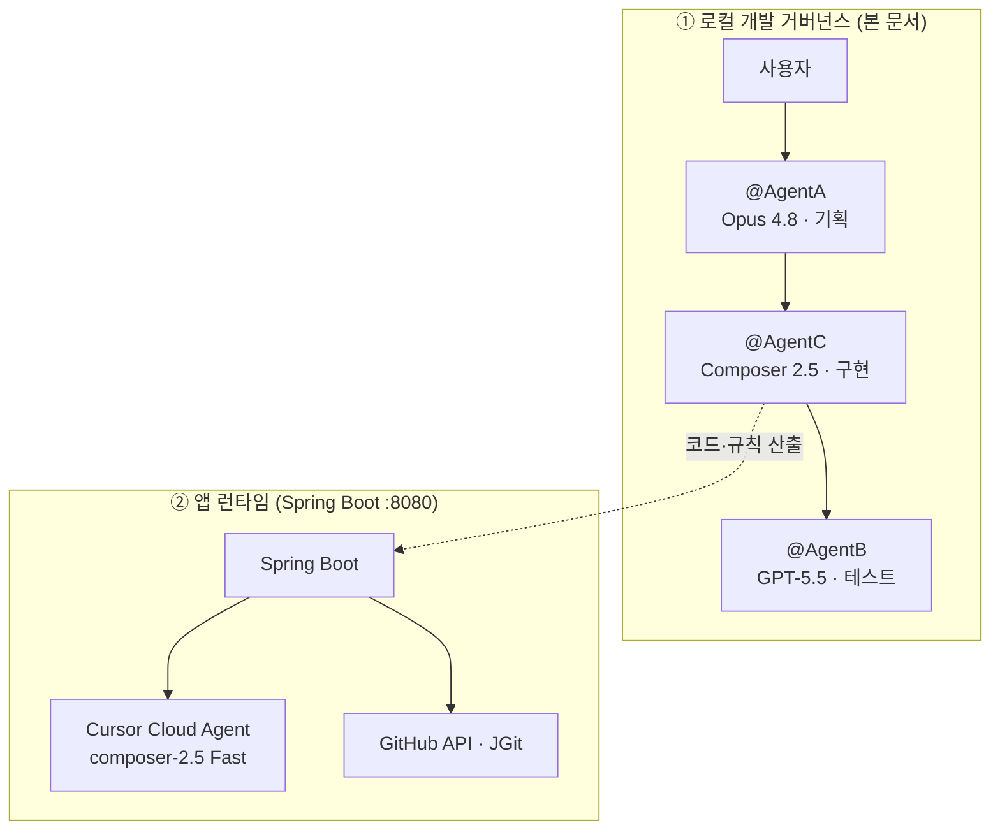

# 6. AI 에이전트 역할 분리 & 인수인계

## 개요

본 저장소는 애플리케이션 코드뿐 아니라, **Cursor AI 에이전트가 역할·권한·인수인계 규칙에 따라 협업하도록 설계한 거버넌스**([`.cursorrules`](../../.cursorrules))를 함께 공개합니다.

> 별도 agent runtime이 아니라, **Cursor Rules 기반 개발 프로세스 거버넌스**입니다.

설계 목표는 다음과 같습니다.

* 기획·구현·테스트를 **한 에이전트에 섞지 않기**
* 산출물·권한·금지 사항을 **명시적으로 분리**
* 작업 완료 시 **Append-only 인수인계**로 다음 에이전트가 맥락을 잃지 않게 하기

## 두 종류의 「에이전트」

이 저장소에서 「에이전트」는 **서로 다른 두 계층**을 가리킵니다. 6번 문서의 주제는 **① 로컬 개발 거버넌스**이며, ②는 앱 런타임입니다.

| 구분 | 대상 | 역할 | 본 문서 범위 |
|------|------|------|-------------|
| **① 개발 거버넌스** | @AgentA / @AgentC / @AgentB | Cursor IDE에서 저장소를 **만드는** 멀티 에이전트 협업 | **주제** |
| **② 앱 런타임** | Cursor Cloud Agent (`composer-2.5` Fast) | Spring Boot가 API로 호출해 **fork branch에 코드를 수정·push** | [1. 아키텍처](01-architecture.md) 참고 |



## 멀티 에이전트 역할 분리

| 에이전트 | 전용 모델(설계) | 역할 | 권한 |
|--------|----------------|------|------|
| **@AgentA** | Claude Opus 4.8 | PRD·API·DB·화면 흐름 기획 | `docs/` 기획 문서 작성 전용 |
| **@AgentC** | Composer 2.5 | v3 기능 구현 (Spring + Cursor API) | 코드·`TECH_SPEC` 작성, `docs/` Read-Only |
| **@AgentB** | GPT-5.5 | 통합 테스트·E2E·회귀 디버깅 | `src/test/**` 중심, 신규 기능 구현은 @AgentC 영역 |

`.cursorrules` 수정 권한은 **사용자만** 가지며, 에이전트는 규칙을 따르는 쪽으로 설계했습니다.

## 멀티 에이전트와 토큰·비용 절감

> **“Opus 4.8을 전 구간이 아니라 기획에만 쓰고, 구현·검증은 Composer·GPT로 분리한 멀티 에이전트 역할 분리로 토큰·비용 절감을 목표했습니다.”**

> **주의:** 아래 토큰·비용 표는 **실측값이 아닌 설계 가정(illustrative)** 입니다. Cursor 과금·토큰 집계 API와 연동하지 않았습니다.

### 비교 시나리오

**가정:** 기획(PRD·API·DB) → 구현(Spring·Cursor API·Thymeleaf) → 통합 테스트·E2E·회귀 디버깅까지 **한 번의 v3 사이클**을 완료한다.

| 방식 | 담당 | 특징 |
|------|------|------|
| **A. 단일 모델** | Claude Opus 4.8을 **기획·구현·테스트 전 구간**에 사용 | 스레드는 컨텍스트 한도에 따라 **여러 개로 나뉠 수 있음**. 다만 **모든 단계에서 동일한 고가 모델** 사용 |
| **B. 멀티 에이전트 (본 프로젝트)** | @AgentA(Opus) → @AgentC(Composer 2.5) → @AgentB(GPT-5.5) | 단계별 **모델 티어 분리** + `.cursorrules`로 역할·산출물 고정 + `STATUS.md` 인수인계 |

### 추정 토큰·상대 비용

Opus를 **입·출력 모두 고가 티어**, Composer·GPT-5.5를 **구현·검증에 상대적으로 저렴한 티어**로 둔 **상대 비용 지수**입니다. (Opus 단일 = 100 기준)

| 단계 | A. Opus 단일 (추정) | B. 역할 분리 (추정) |
|------|---------------------|---------------------|
| 기획 | Opus — 입력 ~180K / 출력 ~90K | **@AgentA Opus** — 입력 ~120K / 출력 ~70K (`docs/`만, 코드 미접근) |
| 구현 | Opus — 입력 ~650K / 출력 ~280K (여러 스레드에 걸쳐 코드·설정 반복 탐색) | **@AgentC Composer 2.5** — 입력 ~420K / 출력 ~190K |
| 통합·E2E·디버깅 | Opus — 입력 ~380K / 출력 ~140K (실패 로그·Gradle·JGit 분석도 Opus 단가) | **@AgentB GPT-5.5** — 입력 ~220K / 출력 ~85K |
| **합계 (토큰)** | **입력 ~1.21M / 출력 ~510K** | **입력 ~760K / 출력 ~345K** |
| **상대 비용 지수** | **~100** | **~42~48** (모델 단가 차이 반영 시) |

**해석 (예시):**
기획·구현·통합 테스트까지 **Opus 4.8 하나**로 처리하면 상대 비용 지수 **약 100(추정)** 에 가깝습니다.
**역할별 에이전트 분리**를 적용하면 Opus는 **기획(@AgentA)** 에 집중하고, 구현·검증은 **Composer 2.5 / GPT-5.5**로 넘겨 **약 42~48(추정)** 수준까지 낮출 수 있습니다.
→ **체감 절감 약 50~55%**

### 비용이 줄어드는 이유 (설계 포인트)

1. **모델 티어 매칭 (Model–Task Fit)**
   - Opus: 요구사항·API·DB·화면 흐름 등 **모호함이 큰 기획**
   - Composer 2.5: **대량 코드 생성·수정**
   - GPT-5.5: **테스트·E2E·터미널 디버깅**
   → 토큰 수가 많은 구현·검증 구간에서 고가 모델을 쓰지 않음

2. **컨텍스트 범위 제한 (Scoped Context)**
   - @AgentA: `docs/` 작성 전용 — `src/**` 전체를 매 세션마다 읽지 않음
   - @AgentC: `docs/` Read-Only — 기획 전체를 다시 쓰는 루프 억제
   - @AgentB: 신규 기능 구현 금지 — 테스트 관점 **최소 수정**만 허용

3. **구조화된 인수인계 (스레드 전환 비용 완화)**
   - 단일 Opus 운영도 스레드는 여러 개가 될 수 있으나, **무엇을 다음 세션에 넘길지** 규칙이 없으면 PRD·코드·로그를 **다시 넓게 주입**하기 쉬움
   - `STATUS.md` Append-only는 **다음 에이전트가 읽을 결정 사항**을 고정해, 불필요한 재탐색·재기획을 줄임 (자동 압축은 아님 — 아래 「컨텍스트 압축」 참고)

4. **역할 충돌·중복 작업 감소**
   - 테스트 단계에서 아키텍처를 다시 짜거나, 기획 단계에서 코드를 수정하는 **경계 붕괴**를 `.cursorrules`로 차단
   - 고가 모델로 **중복 작업**을 반복 호출하는 패턴을 구조적으로 억제

### 단일 Opus vs 멀티 에이전트 (요약)

| 항목 | Opus 단일 (전 구간) | 멀티 에이전트 (역할 분리) |
|------|---------------------|---------------------------|
| 고가 모델 사용 구간 | 기획 + 구현 + 테스트 **전 구간** | 기획(**@AgentA**) 위주 |
| 스레드 | 한도에 따라 여러 개 가능 | 단계·에이전트별로 분리 |
| 맥락 전달 | 비구조적 재주입에 의존하기 쉬움 | `STATUS.md` 등 **고정 인수인계** |
| 검증 단계 비용 | Opus 단가로 로그·테스트 분석 | **@AgentB** (상대 저비용) |

* 비용 절감과 함께 **품질·보안(LOCKED 정책)** 을 동시에 지키는 것이 본 설계의 목표입니다.

## 컨텍스트 압축 — 본 프로젝트에는 없음

일반적인 멀티 에이전트 운영에서는 인수인계·업데이트가 비대해지는 것을 막기 위해 **컨텍스트 압축·요약**을 실행하는 경우가 많습니다. **본 저장소의 개발 거버넌스에는 그러한 자동 단계가 설계되어 있지 않습니다.**

| 있는 것 | 없는 것 |
|---------|---------|
| `STATUS.md` **수동** Append-only 인수인계 | `STATUS.md` 자동 롤업·요약 |
| `TECH_SPEC.md` 구현 편차 기록 | 핸드오프 전 LLM 1회 압축 단계 |
| `.cursorrules` **읽기 범위 제한** (Scoped Context) | `CURRENT_STATE.md` 등 스냅샷 파일 |
| `docs/PRD·API·DB` 기획 SSOT | 아카이브·「최신 N건만 읽기」 강제 규칙 |
| Contribute 시 PR 메타 LLM 1회 (`prBody` 내 변경 요약) | @AgentA→C→B **개발 인수인계**용 요약기 |

> Cursor IDE가 긴 채팅에서 플랫폼 차원으로 컨텍스트를 관리할 수는 있으나, 그것은 **본 프로젝트 거버넌스에 문서화·강제된 단계가 아닙니다.**

`STATUS.md`는 누적되면 수천 줄까지 커질 수 있습니다. 에이전트는 **마지막 항목의 「다음 에이전트를 위한 인수인계」** 와 관련 `TECH_SPEC.md` 절을 우선 읽고, 전체 이력은 필요 시에만 참조하는 것이 운영상 권장됩니다.

## Handoff Protocol

### 로컬 문서 역할

| 파일 | 역할 | 공개 GitHub |
|------|------|-------------|
| **`STATUS.md`** | 누가 무엇을 했는지 **인수인계 로그** (Append-only) | 제외 (`.gitignore`) |
| **`TECH_SPEC.md`** | 기획 대비 **구현 편차·운영 메모** — 기획 수정 대신 Append | 제외 |
| **`docs/PRD·API·DB`** | v3 기획 **Single Source of Truth** | 제외 |

### 기본 규칙

1. **동기화:** 작업 시작 시 `STATUS.md` 최우선 정독
2. **Append-only:** `STATUS.md` 덮어쓰기·삭제 금지
3. **기본 체인:** `@AgentA`(기획) → `@AgentC`(구현) → `@AgentB`(통합 테스트·디버깅)
4. **기획↔구현 불일치:** 코드를 먼저 바꾸지 않고, 역할에 맞는 문서(`TECH_SPEC.md` 또는 `STATUS.md`)에 기록 후 다음 에이전트로 넘김. 기획 변경이 필요하면 @AgentA 갱신을 `STATUS.md`에 요청

### 에이전트별 시작 전 필독 순서

| 에이전트 | 읽기 순서 |
|----------|-----------|
| **@AgentA** | `STATUS.md` → (필요 시) 사용자 지시 |
| **@AgentC** | `STATUS.md` → `docs/` v3 → `TECH_SPEC.md` → `README.md` |
| **@AgentB** | `STATUS.md` → `docs/` v3 → `TECH_SPEC.md` |

### 세션·토큰 한도

컨텍스트 한도에 가까워지면 **새 Cursor 채팅**을 열고, 사용자가 `STATUS.md` 최신 항목 또는 요약 브리프를 붙여넣어 다음 에이전트(@AgentC 등)를 호출합니다. 자동 압축 파이프라인은 없으므로 **「다음 에이전트를 위한 인수인계」** 블록을 짧고 실행 가능하게 쓰는 것이 중요합니다.

### 인수인계 포맷

```markdown
### [날짜 및 시간] @작업한에이전트이름
- **수행한 작업:**
- **변경 사항 (기획 수정 시):**
- **다음 에이전트를 위한 인수인계:**
```

### 채워진 예시 (로컬 `STATUS.md` 발췌·요약)

```markdown
### [2026-07-01] @AgentB — v3.0.2 문서 정합 후 회귀 테스트

- **수행한 작업:**
  - @AgentC v3.0.2 문서 정합 후 `./gradlew test` 회귀 수행.
  - stale temp 워크스페이스 정리 후 `--rerun-tasks` 재실행.
  - **결과:** 78 tests / failures 0 / errors 0 / skipped 5 (조건부 live·BankTransfer skip 포함).
  - `CloudAgentClientTest` — `fast=true`, `requestPrMetadataFollowUp` 회귀 통과.

- **변경 사항 (기획 수정 시):** 코드·기획 문서 미수정.

- **다음 에이전트를 위한 인수인계:**
  - v3.0.2 문서·코드 정합 회귀 완료.
  - 잔여 polish: `docs/git_hub_readme/02-features.md` (pr/prepare follow-up 서술).
```

## @AgentB 검증 근거

@AgentB 단계에서 `./gradlew test`로 회귀를 확인합니다. v3.0.2 사이클 기준:

| 항목 | 값 |
|------|-----|
| 총 테스트 | **78** |
| 실패 | **0** |
| 스킵 | **5** (live API·외부 저장소 `@EnabledIf` 등 조건부) |
| 대표 E2E | `AgentE2EFlowIntegrationTest` — Review/Contribute Agent status polling |
| Cloud API 회귀 | `CloudAgentClientTest` — `fast=true`, PR follow-up endpoint |

## LOCKED 정책 (에이전트 공통 금지)

| # | 정책 |
|---|------|
| 1 | JGit `setForce(true)` 등 **force push** 금지 |
| 2 | `GITHUB_TOKEN`, `CURSOR_API_KEY`를 DB·로그·응답·UI·예외 메시지에 **노출 금지** (마스킹 필수) |
| 3 | GitLab/Bitbucket 등 GitHub 외 호스팅 분기 추가 금지 |
| 4 | `application.properties`에 토큰 **실값** 기재 금지 (환경변수 ref만) |
| 5 | Cursor **`autoCreatePR=true`** 로 upstream PR 생성 금지 — Spring `PullRequestService`만 |
| 6 | Node/Python SDK **브릿지**를 v3 필수 경로로 도입 금지 |

추가 LOCKED (구현):

* Cloud Agent 모델 **`composer-2.5` Fast (`fast=true`)** 코드 상수 고정
* repo Agent `autoCreatePR=false` 고정

## @AgentC 구현 범위 (요약)

* **Review (R-B):** fork·branch·Agent push·pull·Diff·보관 (PR 없음)
* **Contribute:** Review + 조건부 commit·upstream PR
* **A1:** Agent push → Spring `fetch/pull` → `headCommitSha` vs working tree Diff
* **M1:** Diff 후 「추가 수정」 시에만 `IdeLauncher`
* **Contribute LLM:** 「PR 진행」 시 Composer follow-up 1회 → commit/PR 메타

패키지 구조 (평탄):

`com.demo.githubcopilotwithcursor.{config|controller|cursor|domain|dto|exception|github|repository|service}`

## 더 보기

전체 규칙·프로젝트 트리·에이전트별 필수 행동은 [`.cursorrules`](../../.cursorrules) 원문을 참고하세요.
